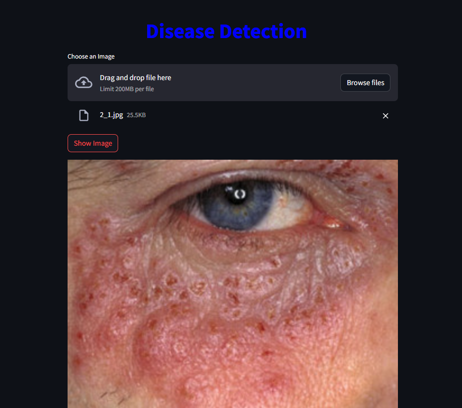

# Skin Disease Detection Website

Welcome to our Skin Disease Detection Website, a cutting-edge platform designed to assist in the early diagnosis and treatment of various skin diseases using deep learning technology.

## Overview

Skin diseases affect millions of people worldwide, often requiring expert diagnosis and timely treatment to prevent complications. Our website offers a user-friendly interface where users can upload images of their skin conditions. The system then analyzes the images using advanced deep learning algorithms to provide a preliminary diagnosis.

## How It Works
1. **Home and About page**: Containes information about the website and Dataset.

1. **Detection Page**: Users upload an image of the affected skin area.

2. **Image Analysis**: The deep learning model processes the image, extracting features and comparing them with its extensive database.
3. **Diagnosis Output**: The system provides a probable diagnosis along with additional information about the detected condition and suggested next steps.

## Technology

Our website is built using the latest technologies in web development and deep learning:
- **Front-end**: Python, Streamlit
- **Back-end**: Python
- **Deep Learning**: Implemented using TensorFlow and Keras, leveraging pre-trained models and fine-tuning them on a specialized skin disease dataset.

## Disclaimer

This platform is intended for preliminary diagnosis and educational purposes only. It should not replace professional medical advice, diagnosis, or treatment. Always consult a healthcare provider for any skin-related concerns.

